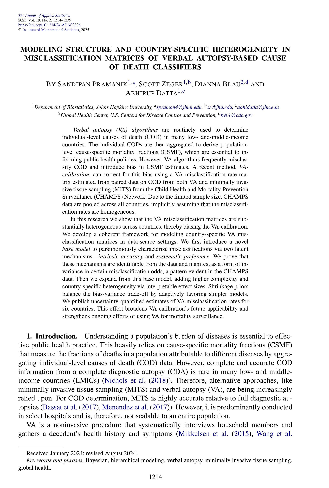
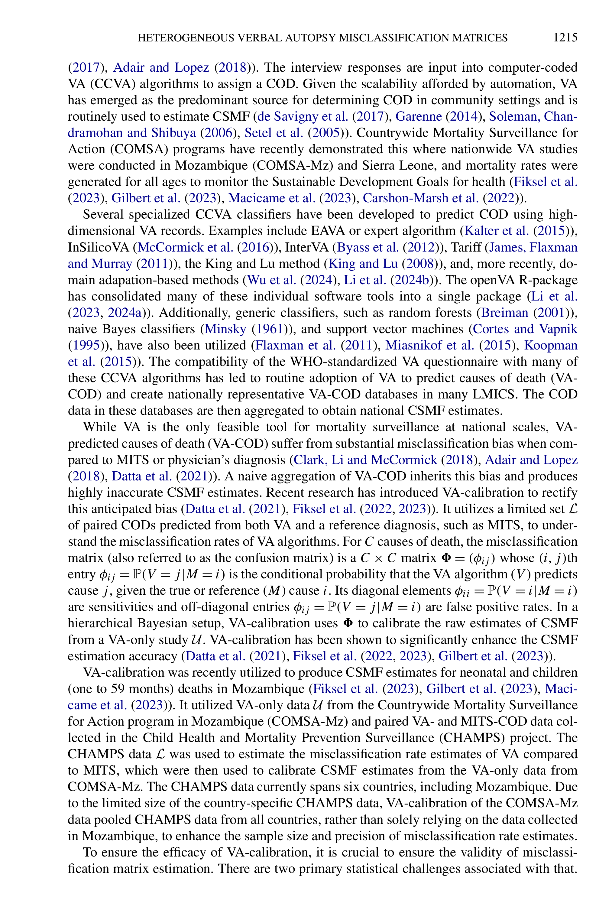
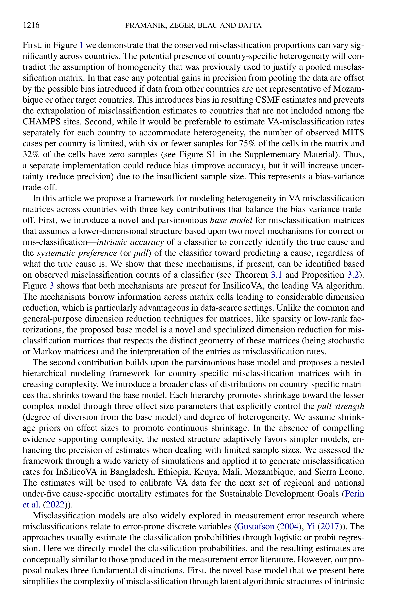
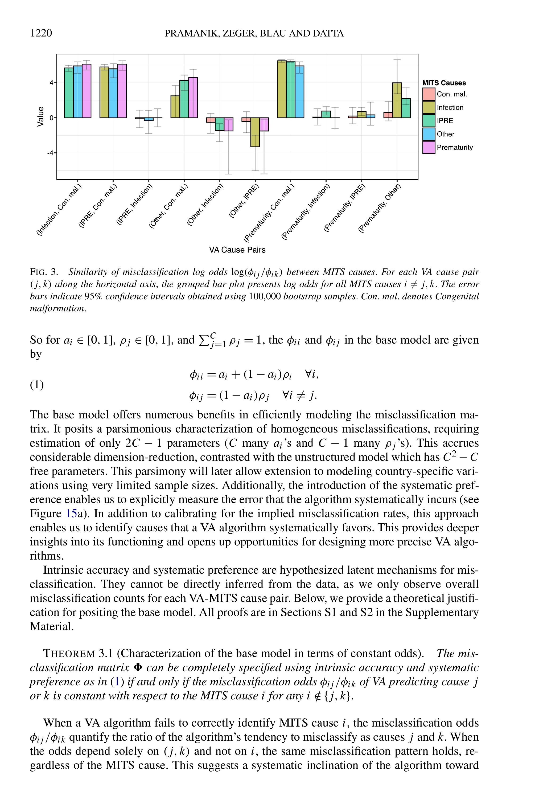
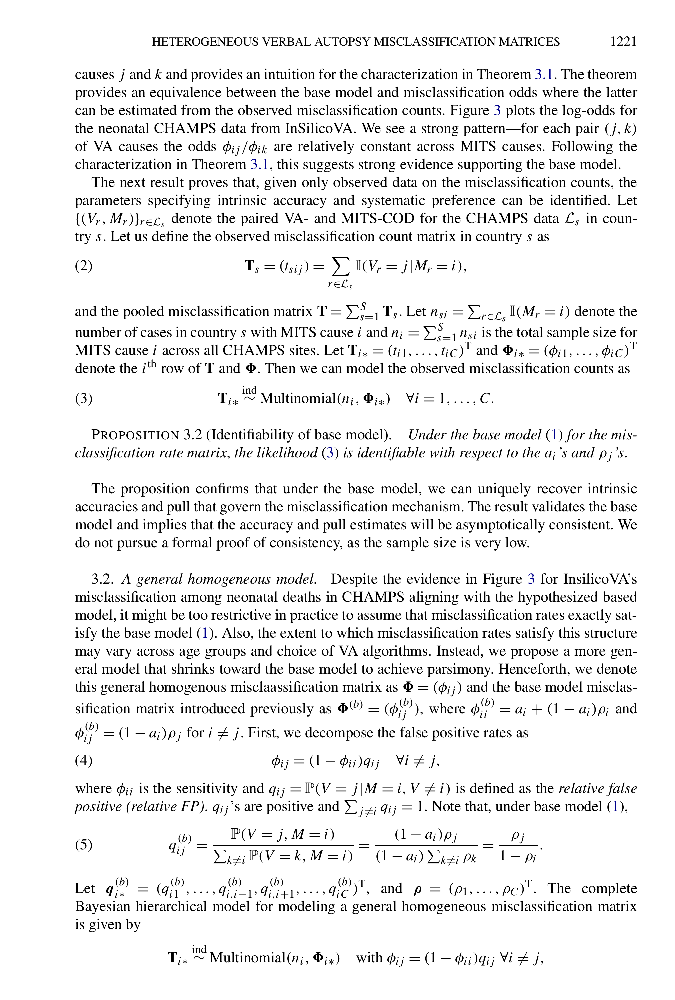
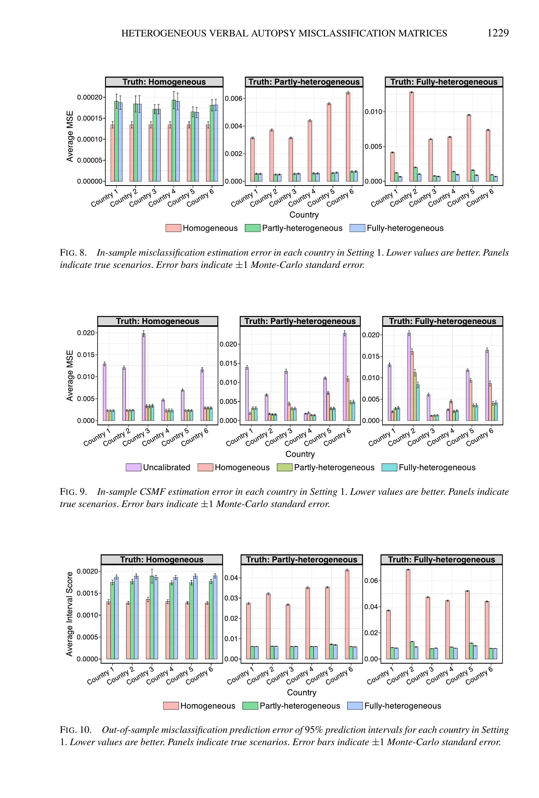
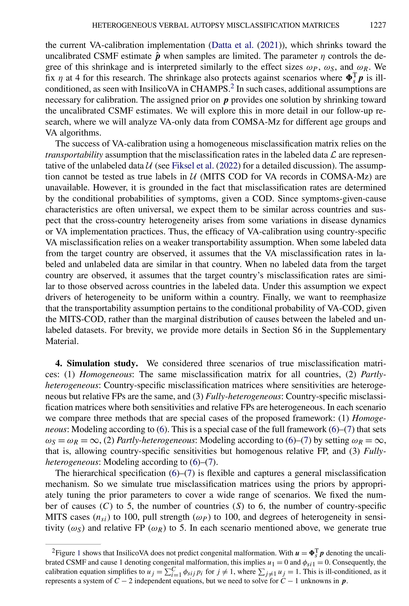
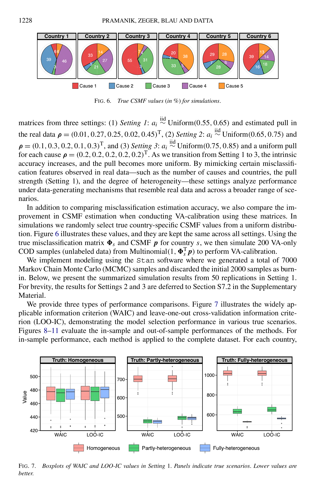
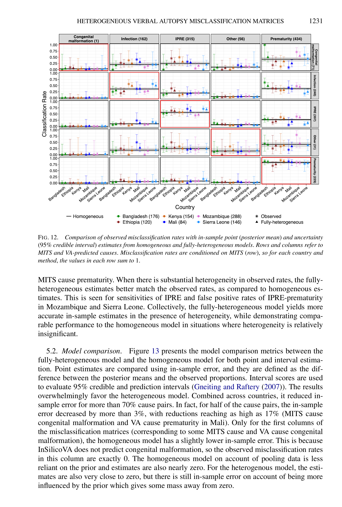
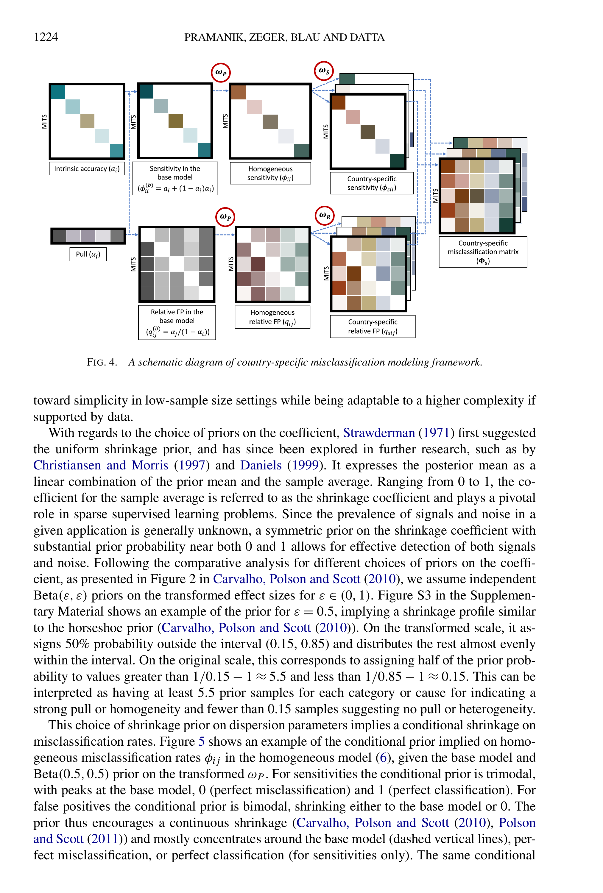

# vacalibration Methodology: Complete Technical Documentation

## Table of Contents

1. [Introduction & Overview](#1-introduction--overview)
2. [Background: Verbal Autopsy and Misclassification](#2-background-verbal-autopsy-and-misclassification)
3. [Mathematical Framework](#3-mathematical-framework)
4. [Hierarchical Bayesian Model](#4-hierarchical-bayesian-model)
5. [Implementation Workflow](#5-implementation-workflow)
6. [Country-Specific Features](#6-country-specific-features)
7. [vacalibration R Package Usage](#7-vacalibration-r-package-usage)
8. [Performance and Validation](#8-performance-and-validation)
9. [Key Innovations](#9-key-innovations)
10. [Transportability Assumptions](#10-transportability-assumptions)
11. [Limitations and Future Directions](#11-limitations-and-future-directions)
12. [Data Sources and Availability](#12-data-sources-and-availability)

---

## 1. Introduction & Overview

### Problem Statement

Verbal autopsy (VA) is a widely used method for determining causes of death in settings without complete vital registration systems. Computer-coded verbal autopsy (CCVA) algorithms automatically assign causes of death based on VA interviews. However, these algorithms systematically misclassify causes of death, leading to biased estimates of cause-specific mortality fractions (CSMF).

### Solution: VA-Calibration

The vacalibration methodology uses gold-standard data from the Child Health and Mortality Prevention Surveillance (CHAMPS) network to estimate algorithm-specific misclassification rates and calibrate CSMF estimates. This approach:

- Quantifies systematic biases in CCVA algorithms
- Provides country-specific misclassification matrices
- Enables uncertainty-quantified calibration of VA-only datasets
- Improves CSMF estimation accuracy

### Key Concepts

- **CSMF (Cause-Specific Mortality Fraction)**: The proportion of deaths attributed to each cause
- **CCVA (Computer-Coded Verbal Autopsy)**: Automated algorithms that classify causes of death from VA data
- **Misclassification Matrix (Φ)**: Matrix quantifying P(VA predicts j | True cause is i)
- **CHAMPS**: Multi-country surveillance network providing paired MITS-VA data
- **MITS (Minimally Invasive Tissue Sampling)**: Gold-standard pathological diagnosis

---

## 2. Background: Verbal Autopsy and Misclassification

### What is Verbal Autopsy?

Verbal autopsy is a systematic method to determine cause of death by interviewing family members or caregivers about the deceased's symptoms, signs, and circumstances. In settings without medical certification of death, VA provides crucial data for understanding mortality patterns and informing public health policy.

### Computer-Coded VA Algorithms

Three major CCVA algorithms are widely used:

1. **EAVA (Expert Algorithm for Verbal Autopsy)**: Rule-based expert system
2. **InSilicoVA**: Bayesian probabilistic model
3. **InterVA**: Probabilistic model based on physician probabilities

Each algorithm processes VA questionnaire data and outputs cause of death classifications, but they exhibit different systematic biases and misclassification patterns.

### The Misclassification Problem


*Figure 1: Country-specific empirical misclassification rates for InSilicoVA, demonstrating substantial heterogeneity across CHAMPS countries.*

CCVA algorithms systematically misclassify causes of death due to:
- Symptom overlap between diseases
- Algorithm design choices and assumptions
- Limited discriminatory power of VA questionnaires
- Country-specific epidemiological patterns

Without correction, these misclassifications bias CSMF estimates and can mislead public health decision-making.

### CHAMPS Project as Gold Standard

The CHAMPS network conducts Minimally Invasive Tissue Sampling (MITS) alongside verbal autopsies in seven countries:
- Bangladesh
- Ethiopia
- Kenya
- Mali
- Mozambique
- Sierra Leone
- South Africa

MITS provides pathologically-confirmed causes of death, enabling direct estimation of CCVA misclassification rates by comparing VA predictions to MITS diagnoses.

---

## 3. Mathematical Framework

### 3.1 Misclassification Matrix Notation

**Definition**: The misclassification matrix Φ = (φᵢⱼ) quantifies algorithm performance:

$$\phi_{ij} = P(V = j \mid M = i)$$

Where:
- **V**: VA-predicted cause of death
- **M**: MITS (true) cause of death
- **i, j**: Cause indices (i, j = 1, ..., C for C causes)

**Equation 1 - Misclassification Matrix Structure:**

$$\Phi = \begin{bmatrix}
\phi_{11} & \phi_{12} & \cdots & \phi_{1C} \\
\phi_{21} & \phi_{22} & \cdots & \phi_{2C} \\
\vdots & \vdots & \ddots & \vdots \\
\phi_{C1} & \phi_{C2} & \cdots & \phi_{CC}
\end{bmatrix}$$

**Matrix Elements:**
- **Diagonal elements (φᵢᵢ)**: Sensitivities = P(V = i|M = i) - correct classification
- **Off-diagonal elements (φᵢⱼ, i≠j)**: False positives = P(V = j|M = i) - misclassification

**Simple Example (C=3 causes):**

Suppose we have 3 causes: Pneumonia, Sepsis, Prematurity

```
         VA Pred:    Pneumonia  Sepsis  Prematurity
MITS True:
Pneumonia              0.70      0.20      0.10
Sepsis                 0.15      0.75      0.10
Prematurity            0.10      0.10      0.80
```

**Interpretation:**
- φ₁₁ = 0.70: When true cause is Pneumonia, VA correctly predicts it 70% of the time (sensitivity)
- φ₁₂ = 0.20: When true cause is Pneumonia, VA incorrectly predicts Sepsis 20% of the time
- Each row sums to 1 (Markov/stochastic property)

**Stochastic Matrix Properties:**
- All entries non-negative: φᵢⱼ ≥ 0
- Rows sum to 1: Σⱼ φᵢⱼ = 1 for all i
- This ensures conditional probabilities are valid

### 3.2 VA-Calibration Equation

**Equation 2 - VA-Calibration Formula:**

$$q_j = \sum_{i=1}^{C} \phi_{ij} p_i \quad \text{for } j = 1, \ldots, C$$

Or in matrix form:

$$\mathbf{q} = \Phi^{\top} \mathbf{p}$$

Where:
- **q** = (q₁, ..., qᴄ): Uncalibrated CSMF from VA-only data
- **p** = (p₁, ..., pᴄ): True CSMF (unknown, to be estimated)
- **Φ**: Misclassification matrix

**Simple Numerical Example:**

Given:
- True CSMF: p = [0.30, 0.50, 0.20] (30% Pneumonia, 50% Sepsis, 20% Prematurity)
- Misclassification matrix Φ from previous example

Calculate uncalibrated CSMF q:

```
q₁ (Pneumonia) = 0.70×0.30 + 0.15×0.50 + 0.10×0.20
               = 0.21 + 0.075 + 0.02 = 0.305

q₂ (Sepsis) = 0.20×0.30 + 0.75×0.50 + 0.10×0.20
            = 0.06 + 0.375 + 0.02 = 0.455

q₃ (Prematurity) = 0.10×0.30 + 0.10×0.50 + 0.80×0.20
                 = 0.03 + 0.05 + 0.16 = 0.240
```

Result: q = [0.305, 0.455, 0.240]

**Interpretation**: Even though true Sepsis is 50%, VA-only data shows 45.5% due to misclassification. The algorithm under-predicts Sepsis because it misclassifies some Sepsis cases as other causes.

**Inverse Problem**: Given observed q and estimated Φ, solve for p
- This is an ill-posed inverse problem without regularization
- Bayesian approach provides natural regularization through priors
- vacalibration uses hierarchical priors to stabilize estimates

### 3.3 Base Model: Intrinsic Accuracy and Pull


*Figure 2: Schematic showing intrinsic accuracy (diagonal effect) and pull (column effect) as fundamental mechanisms of misclassification.*

**Two Fundamental Mechanisms:**

The base model decomposes misclassification into two interpretable components:

1. **Intrinsic Accuracy (aᵢ)**: Algorithm's ability to correctly identify cause i by design
   - Range: aᵢ ∈ [0, 1]
   - Higher aᵢ means algorithm is better designed to detect cause i
   - Reflects how well symptoms/signs discriminate cause i

2. **Pull (ρⱼ)**: Systematic preference toward predicting cause j
   - Range: ρⱼ ∈ [0, 1], with Σⱼ ρⱼ = 1
   - Represents algorithm's bias toward certain predictions
   - Can arise from prior probabilities or decision thresholds

**Equation 3 - Base Model Formulation:**

For sensitivities (diagonal):

$$\phi_{ii} = a_i + (1 - a_i)\rho_i \quad \text{for all } i$$

For false positives (off-diagonal):

$$\phi_{ij} = (1 - a_i)\rho_j \quad \text{for all } i \neq j$$

**Intuition:**
- When algorithm fails to correctly identify cause i (probability 1 - aᵢ), it "pulls" toward all causes according to systematic preference ρ
- Sensitivity gets a boost from intrinsic accuracy aᵢ plus the base pull ρᵢ
- All off-diagonal elements in row i share the same structure: (1 - aᵢ) times the pull

**Simple Numerical Example (C=3):**

Let's construct a misclassification matrix using intrinsic accuracy and pull:

Given:
- Intrinsic accuracies: a = [0.60, 0.70, 0.75] (Pneumonia, Sepsis, Prematurity)
- Pull: ρ = [0.25, 0.40, 0.35]

Calculate Φ:

**Row 1 (MITS = Pneumonia, i=1):**
- φ₁₁ = 0.60 + (1-0.60)×0.25 = 0.60 + 0.10 = 0.70 ✓ (sensitivity)
- φ₁₂ = (1-0.60)×0.40 = 0.40×0.40 = 0.16 (FP)
- φ₁₃ = (1-0.60)×0.35 = 0.40×0.35 = 0.14 (FP)
- Check: 0.70 + 0.16 + 0.14 = 1.00 ✓

**Row 2 (MITS = Sepsis, i=2):**
- φ₂₁ = (1-0.70)×0.25 = 0.30×0.25 = 0.075 (FP)
- φ₂₂ = 0.70 + (1-0.70)×0.40 = 0.70 + 0.12 = 0.82 ✓ (sensitivity)
- φ₂₃ = (1-0.70)×0.35 = 0.30×0.35 = 0.105 (FP)
- Check: 0.075 + 0.82 + 0.105 = 1.00 ✓

**Row 3 (MITS = Prematurity, i=3):**
- φ₃₁ = (1-0.75)×0.25 = 0.25×0.25 = 0.0625 (FP)
- φ₃₂ = (1-0.75)×0.40 = 0.25×0.40 = 0.10 (FP)
- φ₃₃ = 0.75 + (1-0.75)×0.35 = 0.75 + 0.0875 = 0.8375 ✓ (sensitivity)
- Check: 0.0625 + 0.10 + 0.8375 = 1.00 ✓

**Resulting Matrix:**

```
Φ = [0.700   0.160   0.140 ]
    [0.075   0.820   0.105 ]
    [0.063   0.100   0.838 ]
```

**Dimension Reduction:**
- **Unstructured model**: C² - C free parameters (6 for C=3)
- **Base model**: 2C - 1 parameters (5 for C=3: three a's + two free ρ's)
- For C=5 causes: Unstructured = 20 parameters vs Base model = 9 parameters
- For C=10 causes: Unstructured = 90 parameters vs Base model = 19 parameters

**Key Insight:** Pull (ρ) is a **column effect** - it's the same across all MITS causes (rows) for a given VA prediction. This structural assumption dramatically reduces model complexity while remaining interpretable.

### 3.4 Theorem 3.1: Characterization via Constant Odds


*Figure 3: Similarity of misclassification log odds between MITS causes for InSilicoVA, providing empirical validation of Theorem 3.1.*

**Theorem 3.1 Statement:**

The misclassification matrix Φ can be completely specified using intrinsic accuracy and systematic preference (base model) **if and only if** the misclassification odds φᵢⱼ/φᵢₖ are constant with respect to MITS cause i for any i ∉ {j,k}.

**Equation 4 - Constant Odds Characterization:**

$$\frac{\phi_{ij}}{\phi_{ik}} = \text{constant (independent of } i\text{)} \quad \text{for all } i \notin \{j,k\}$$

**Mathematical Proof Sketch:**

Under the base model:

$$\phi_{ij} = (1 - a_i)\rho_j$$
$$\phi_{ik} = (1 - a_i)\rho_k$$

Therefore:

$$\frac{\phi_{ij}}{\phi_{ik}} = \frac{(1 - a_i)\rho_j}{(1 - a_i)\rho_k} = \frac{\rho_j}{\rho_k}$$

The ratio depends only on (j,k) and NOT on i! ✓

**Simple Numerical Example:**

Using our previous example matrix:

```
Φ = [0.700   0.160   0.140 ]
    [0.075   0.820   0.105 ]
    [0.063   0.100   0.838 ]
```

Test odds for j=2 (Sepsis) vs k=3 (Prematurity), excluding diagonal:

For MITS i=1: φ₁₂/φ₁₃ = 0.16/0.14 = 1.143

This should equal ρ₂/ρ₃ = 0.40/0.35 = 1.143 ✓

**Interpretation:**
- If constant odds hold → base model is appropriate
- Identifies systematic preference structure in data
- Provides testable characterization of model assumptions
- Figure 3 shows this holds empirically for InSilicoVA in CHAMPS data

**Proposition 3.2 - Identifiability:**

Given observed misclassification counts T = (tᵢⱼ), the base model parameters {aᵢ, ρⱼ} are uniquely identifiable.

**Equation 5 - Likelihood for Observed Counts:**

$$T_{i*} \sim \text{Multinomial}(n_i, \Phi_{i*}) \quad \text{for } i = 1, \ldots, C$$

Where:
- Tᵢ* = (tᵢ₁, tᵢ₂, ..., tᵢᴄ): Observed counts for MITS cause i
- nᵢ = Σⱼ tᵢⱼ: Total count for MITS cause i
- Φᵢ* = (φᵢ₁, φᵢ₂, ..., φᵢᴄ): Row i of misclassification matrix

---

## 4. Hierarchical Bayesian Model


*Figure 4: Complete schematic of country-specific misclassification modeling framework, showing nested hierarchy and role of effect sizes ωₚ, ωₛ, ωᵣ.*


*Figure 5: Conditional prior on misclassification rates showing tri-modal shrinkage behavior toward base model, zero, and one.*

### 4.1 Homogeneous Model

The homogeneous model pools data across all countries while maintaining the base model structure.

**Decomposition of Misclassification Matrix:**

**Equation 6 - Sensitivity and Relative FP Decomposition:**

$$\phi_{ij} = (1 - \phi_{ii}) \times q_{ij} \quad \text{for } i \neq j$$

Where:
- **φᵢᵢ**: Sensitivity for cause i
- **qᵢⱼ**: Relative false positive = P(V = j | M = i, V ≠ i)
- Constraint: Σ_{j≠i} qᵢⱼ = 1

This decomposition separates the probability of correct classification (sensitivity) from the distribution of misclassifications when errors occur (relative FP).

**Equation 7 - Relative FP Under Base Model:**

$$q^{(b)}_{ij} = \frac{\rho_j}{1 - \rho_i} \quad \text{for } i \neq j$$

**Complete Hierarchical Model:**

**Equation 8 - Homogeneous Model Specification:**

**Likelihood:**
$$T_{i*} \sim \text{Multinomial}(n_i, \Phi_{i*})$$

**Prior on Sensitivity:**
$$\phi_{ii} \sim \text{Beta}(0.5 + \kappa\phi^{(b)}_{ii}, \, 0.5 + \kappa(1 - \phi^{(b)}_{ii}))$$

**Prior on Relative FP:**
$$q_{i*} \sim \text{Dirichlet}(0.5 + \lambda q^{(b)}_{i*})$$

**Prior on Intrinsic Accuracy:**
$$a_i \sim \text{Beta}(b, d)$$

**Prior on Pull:**
$$\rho \sim \text{Dirichlet}(e)$$

Where:
- **κ, λ**: Effect sizes controlling pull strength toward base model
- **φ^(b)ᵢᵢ, q^(b)ᵢ***: Base model values
- **b, d, e**: Hyperparameters (default: b=d=1 for uniform, e=𝟏 for uniform Dirichlet)

**Simple Numerical Example:**

Suppose for cause i=1 (Pneumonia):
- Base model sensitivity: φ^(b)₁₁ = 0.70
- Effect size κ = 10

Beta prior parameters:
- α = 0.5 + 10 × 0.70 = 0.5 + 7.0 = 7.5
- β = 0.5 + 10 × 0.30 = 0.5 + 3.0 = 3.5

Beta(7.5, 3.5) has:
- Mean = 7.5/(7.5+3.5) = 0.682 ≈ 0.70
- Variance = (7.5×3.5)/[(7.5+3.5)²×12] = 0.0173

**Effect Size Interpretation:**
- κ → ∞: Degenerate at base model (φᵢᵢ = φ^(b)ᵢᵢ exactly)
- κ → 0: Jeffreys prior Beta(0.5, 0.5) (no structure, U-shaped prior)
- Moderate κ: Shrinkage toward base model with flexibility

### 4.2 Country-Specific Heterogeneous Model

The country-specific model allows misclassification rates to vary across countries while borrowing strength through hierarchical shrinkage.

**Equation 9 - Country-Specific Heterogeneous Model:**

**Likelihood for Country s:**
$$T_{si*} \sim \text{Multinomial}(n_{si}, \Phi_{si*})$$

**Country-Specific Sensitivity:**
$$\phi_{sii} \sim \text{Beta}(0.5 + \gamma\phi_{ii}, \, 0.5 + \gamma(1 - \phi_{ii}))$$

**Country-Specific Relative FP:**
$$q_{si*} \sim \text{Dirichlet}(0.5 + \delta q_{i*})$$

**Plus Priors on Pooled Parameters:**
$$\phi_{ii}, \, q_{i*}, \, a_i, \, \rho \quad \text{as in Equation 8}$$

Where:
- **s**: Country index (s = 1, ..., S)
- **φₛᵢᵢ, qₛᵢ***: Country-specific misclassification parameters (random effects)
- **φᵢᵢ, qᵢ***: Pooled parameters (fixed effects)
- **γ, δ**: Effect sizes controlling degree of homogeneity across countries

**Hierarchical Structure:**

```
Data: Tₛᵢ*
  ↓
Country-specific: φₛᵢᵢ, qₛᵢ* (random effects)
  ↓
Pooled: φᵢᵢ, qᵢ* (fixed effects)
  ↓
Base model: aᵢ, ρ (structural parameters)
```

**Simple Numerical Example:**

**Setup:**
- Pooled sensitivity for cause i: φᵢᵢ = 0.75
- Homogeneity effect size: γ = 10
- Three countries: Bangladesh, Mozambique, Kenya

**Beta Prior for Country-Specific Sensitivities:**
- α = 0.5 + 10 × 0.75 = 8.0
- β = 0.5 + 10 × 0.25 = 3.0

**Simulated Country-Specific Values:**
- Bangladesh: φ_{Bangladesh,ii} ~ Beta(8.0, 3.0) → Sample = 0.78
- Mozambique: φ_{Mozambique,ii} ~ Beta(8.0, 3.0) → Sample = 0.72
- Kenya: φ_{Kenya,ii} ~ Beta(8.0, 3.0) → Sample = 0.76

Mean of Beta(8.0, 3.0) = 8/(8+3) = 0.727 ≈ 0.75 ✓

**Interpretation:**
- All country values cluster around pooled value 0.75
- γ = 10 provides moderate homogeneity
- Larger γ → more shrinkage toward pooled value (countries more similar)
- Smaller γ → more heterogeneity allowed (countries more different)

### 4.3 Effect Size Interpretation

**Equation 10 - Effect Size Parameterization:**

$$\kappa = 2\omega_p$$
$$\lambda = (C-1)\omega_p$$
$$\gamma = 2\omega_s$$
$$\delta = (C-1)\omega_r$$

Where:
- **ωₚ**: Pull strength (prior sample size per category)
- **ωₛ**: Homogeneity in sensitivity across countries
- **ωᵣ**: Homogeneity in relative FP across countries

**Interpretation as Prior Sample Sizes:**

The effect sizes represent equivalent prior sample sizes:

**For sensitivity (2 categories: correct vs incorrect):**
- Prior contributes κ = 2ωₚ samples
- Data contributes nᵢ samples
- Prior weight: κ/(κ + nᵢ) × 100%

**For relative FP (C-1 categories):**
- Prior contributes λ = (C-1)ωₚ samples
- Each cause gets ωₚ samples

**Numerical Example (C=5 causes):**

**Scenario 1: Strong Pull (ωₚ = 100)**
- κ = 2 × 100 = 200
- λ = 4 × 100 = 400
- If nᵢ = 50 observed samples:
  - Prior weight = 200/(200+50) = 80%
  - Data weight = 50/(200+50) = 20%
  - **Interpretation**: Strong shrinkage toward base model

**Scenario 2: Weak Pull (ωₚ = 1)**
- κ = 2 × 1 = 2
- λ = 4 × 1 = 4
- If nᵢ = 50 observed samples:
  - Prior weight = 2/(2+50) = 3.8%
  - Data weight = 50/(2+50) = 96.2%
  - **Interpretation**: Data dominates, little structure

**Scenario 3: Moderate Homogeneity (ωₛ = 10, C=5)**
- γ = 2 × 10 = 20
- For country with nₛᵢ = 30 samples:
  - Pooled estimate weight = 20/(20+30) = 40%
  - Country-specific data weight = 30/(20+30) = 60%
  - **Interpretation**: Balance between pooled and country-specific

**Table: Effect Size Interpretation**

| ωₚ | Pull Strength | κ (C=5) | Interpretation |
|----|---------------|---------|----------------|
| 0.1 | None | 0.2 | No systematic preference |
| 1 | Weak | 2 | Minimal structure |
| 10 | Moderate | 20 | Balanced shrinkage |
| 100 | Strong | 200 | Strong base model |
| ∞ | Perfect | ∞ | Exact base model |


*Figure 14: Posterior distributions of effect sizes (ωₚ, ωₛ, ωᵣ) from real CHAMPS data, showing estimated pull strength and homogeneity levels.*

### 4.4 Shrinkage Priors

**Equation 11 - Shrinkage Prior on Effect Sizes:**

Transform effect sizes to [0, 1]:

$$f(\omega) = \frac{1}{1 + \omega}$$

Then assign Beta priors on transformed scale:

$$f(\omega_p) \sim \text{Beta}(\epsilon, \epsilon)$$
$$f(\omega_s) \sim \text{Beta}(\epsilon, \epsilon)$$
$$f(\omega_r) \sim \text{Beta}(\epsilon, \epsilon)$$

Default: ε = 0.5 (horseshoe-like shrinkage)

**Interpretation on Original Scale:**

- f(ω) = 0: ω = ∞ (perfect structure/homogeneity)
- f(ω) = 1: ω = 0 (no structure/heterogeneity)
- f(ω) = 0.5: ω = 1 (moderate)

**Properties of Beta(0.5, 0.5):**
- Bi-modal with modes at 0 and 1
- U-shaped density
- Encourages extreme values (either structure or no structure)
- Median = 0.5
- Allows data to choose between strong structure and flexibility

**Numerical Example:**

Beta(0.5, 0.5) assigns probability mass:
- P(f(ω) < 0.15) ≈ 0.25 → Corresponds to ω > 5.7 (strong structure)
- P(f(ω) > 0.85) ≈ 0.25 → Corresponds to ω < 0.18 (weak structure)
- P(0.15 < f(ω) < 0.85) ≈ 0.50 (moderate range)

**Horseshoe-Like Profile:**

The shrinkage profile resembles the horseshoe prior (Carvalho, Polson & Scott, 2010):
- Strong shrinkage for signals near zero
- Minimal shrinkage for strong signals
- Smooth transition in between
- Adaptive to data strength

**Continuous Shrinkage Formula:**

Posterior mean has form:

$$E[\phi_{ij} \mid \text{Data}] \approx w \times \phi^{(b)}_{ij} + (1-w) \times \phi^{(MLE)}_{ij}$$

Where w depends on posterior of effect sizes:
- w ≈ κ/(κ + nᵢ) for sensitivities
- w learned from data adaptively
- Larger κ → larger w → more shrinkage

**Adaptive Complexity Selection:**

The framework automatically selects model complexity:

**1. Low Sample Size (n small):**
- Data weak → Prior dominates
- Shrinks toward simpler model (base model)
- Example: n=10, κ=20 → 67% prior weight

**2. High Sample Size (n large):**
- Data strong → Prior weakened
- Allows departure from base model if warranted
- Example: n=100, κ=20 → 17% prior weight

**3. Strong Evidence in Data:**
- Posterior ω small → Less structure
- Allows heterogeneity/complexity

**4. Weak Evidence in Data:**
- Posterior ω large → More structure
- Enforces homogeneity/simplicity

This adaptive behavior is crucial for handling CHAMPS data, where sample sizes vary dramatically across countries and causes. Figure 5 (conditional priors) shows the tri-modal nature of the shrinkage, encouraging continuous regularization while remaining flexible.

### 4.5 Summary of Key Equations

**Complete Equation List:**

1. **Misclassification Matrix**: Φ = (φᵢⱼ), φᵢⱼ = P(V = j|M = i)
2. **VA-Calibration**: q = Φᵀp
3. **Base Model Sensitivity**: φᵢᵢ = aᵢ + (1 - aᵢ)ρᵢ
4. **Base Model FP**: φᵢⱼ = (1 - aᵢ)ρⱼ for i ≠ j
5. **Constant Odds**: φᵢⱼ/φᵢₖ = ρⱼ/ρₖ (independent of i)
6. **Decomposition**: φᵢⱼ = (1 - φᵢᵢ)qᵢⱼ
7. **Relative FP**: q^(b)ᵢⱼ = ρⱼ/(1 - ρᵢ)
8. **Likelihood**: Tᵢ* ~ Multinomial(nᵢ, Φᵢ*)
9. **Sensitivity Prior**: φᵢᵢ ~ Beta(0.5 + κφ^(b)ᵢᵢ, 0.5 + κ(1 - φ^(b)ᵢᵢ))
10. **Relative FP Prior**: qᵢ* ~ Dirichlet(0.5 + λq^(b)ᵢ*)
11. **Country-Specific Sensitivity**: φₛᵢᵢ ~ Beta(0.5 + γφᵢᵢ, 0.5 + γ(1 - φᵢᵢ))
12. **Country-Specific FP**: qₛᵢ* ~ Dirichlet(0.5 + δqᵢ*)
13. **Effect Sizes**: κ = 2ωₚ, λ = (C-1)ωₚ, γ = 2ωₛ, δ = (C-1)ωᵣ
14. **Shrinkage Transform**: f(ω) = 1/(1 + ω), f(ω) ~ Beta(ε, ε)
15. **Intrinsic Accuracy**: aᵢ ~ Beta(b, d)
16. **Pull**: ρ ~ Dirichlet(e)
17. **Posterior Mean**: E[φ | Data] ≈ w·φ^(prior) + (1-w)·φ^(MLE)

---

## 5. Implementation Workflow


*Figure 12: Comparison of observed rates with in-sample estimates from homogeneous vs fully-heterogeneous models.*


*Figure 13: Change in absolute in-sample error and interval scores comparing model performance.*


*Figure 15: Posteriors of intrinsic accuracies and pull for InSilicoVA, revealing algorithm strengths and biases.*


*Figure 17: InSilicoVA's misclassification rate estimates in Mozambique, comparing homogeneous vs fully-heterogeneous models.*

### 5.1 Data Requirements

**Labeled Data (CHAMPS):**
- Paired MITS-VA cause of death data
- Age groups: Neonates (0-27 days), Children (1-59 months)
- Countries: Bangladesh, Ethiopia, Kenya, Mali, Mozambique, Sierra Leone, South Africa, Other
- Time period: 2016-2023
- Sample sizes vary by country (tens to hundreds per country-age group)

**Unlabeled Data (e.g., COMSA):**
- VA-only cause of death data
- Same age groups
- Country identification for matching misclassification matrices
- Can be from any VA survey or surveillance system

### 5.2 Step-by-Step Workflow

The vacalibration pipeline consists of two phases:

#### Phase 1: Estimate Misclassification Matrices from CHAMPS

**Step 1: Input Paired MITS-VA COD Data**

Data structure: {(Mᵣ, Vᵣ)}ᵣ∈Lₛ for each country s

Where:
- Mᵣ: MITS cause of death for death r
- Vᵣ: VA-predicted cause of death for death r
- Lₛ: Set of labeled cases in country s

**Step 2: Construct Observed Misclassification Count Matrix**

$$T_s = (t_{sij})$$
$$t_{sij} = \sum_{r \in L_s} I(M_r = i, V_r = j)$$
$$n_{si} = \sum_j t_{sij} \quad \text{(total MITS cases for cause } i \text{ in country } s\text{)}$$

**Step 3: Apply Hierarchical Model**

Fit the country-specific hierarchical model (Equation 9) using MCMC:

**Likelihood:**
$$T_{si*} \sim \text{Multinomial}(n_{si}, \Phi_{si*})$$

**Priors (Country-Specific Layer):**
$$\phi_{sii} \sim \text{Beta}(0.5 + \gamma\phi_{ii}, \, 0.5 + \gamma(1 - \phi_{ii}))$$
$$q_{si*} \sim \text{Dirichlet}(0.5 + \delta q_{i*})$$

**Priors (Pooled Layer):**
$$\phi_{ii} \sim \text{Beta}(0.5 + \kappa\phi^{(b)}_{ii}, \, 0.5 + \kappa(1 - \phi^{(b)}_{ii}))$$
$$q_{i*} \sim \text{Dirichlet}(0.5 + \lambda q^{(b)}_{i*})$$

**Priors (Base Model Layer):**
$$a_i \sim \text{Beta}(1, 1) \quad \text{[Uniform]}$$
$$\rho \sim \text{Dirichlet}(\mathbf{1}) \quad \text{[Uniform]}$$

**Effect Size Priors:**
$$f(\omega_p), f(\omega_s), f(\omega_r) \sim \text{Beta}(0.5, 0.5)$$

**Step 4: MCMC Sampling using Stan**
- Run 7,000 iterations
- Discard first 2,000 as burn-in
- Keep 5,000 posterior samples
- Monitor convergence diagnostics (R-hat, effective sample size)

**Step 5: Output**
- Posterior samples: {Φₛ^(m)}_{m=1}^{5000} for each country s
- Posterior means: E[Φₛ | Data]
- 95% credible intervals
- Marginal posteriors approximated as Dirichlet distributions for Phase 2

**Numerical Example:**

**Input Data for Mozambique, Neonates, InSilicoVA:**

Observed counts T_Moz:

```
           VA_Pred:  IPRE  Infection  Prematurity  Congenital  Other
MITS_True:
IPRE               [  60      15          10           0        0  ]
Infection          [   8      45           5           0        0  ]
Prematurity        [  20      10         120           0        5  ]
Congenital         [   0       0           0          15        2  ]
Other              [   2       3           5           1       11  ]
```

Sample sizes: n = [85, 58, 155, 17, 22]

**After MCMC, Estimated Φ_Moz:**

Posterior means:

```
           VA_Pred:  IPRE  Infection  Prematurity  Congenital  Other
MITS_True:
IPRE               [ 0.69    0.18        0.12         0.00      0.01 ]
Infection          [ 0.13    0.75        0.10         0.00      0.02 ]
Prematurity        [ 0.14    0.07        0.76         0.00      0.03 ]
Congenital         [ 0.02    0.02        0.05         0.85      0.06 ]
Other              [ 0.10    0.13        0.20         0.05      0.52 ]
```

Note: Estimates are smoothed compared to raw proportions (e.g., raw 60/85 = 0.706 becomes 0.69) due to hierarchical shrinkage toward pooled and base model values.

#### Phase 2: Modular VA-Calibration

**Objective**: Calibrate VA-only data U from target country to estimate true CSMF p

**Equation 12 - VA-Calibration Model:**

**Likelihood:**
$$V_r \sim \text{Multinomial}(1, \Phi_s^\top p) \quad \text{for } r \in U$$

**Prior on Misclassification Matrix:**
$$\Phi_{si*} \sim \text{Dirichlet}(e_{si}) \quad \text{[From Phase 1 posterior]}$$

**Prior on CSMF:**
$$p \sim \text{Dirichlet}(1 + C\eta \hat{p}) \quad \text{[Shrinkage toward uncalibrated]}$$

Where:
- **U**: VA-only dataset from country s
- **p**: True CSMF (unknown parameter to estimate)
- **p̂**: Uncalibrated CSMF = observed proportions in U
- **Φₛ**: Misclassification matrix for country s (uncertainty from Phase 1)
- **eₛᵢ**: Dirichlet parameters approximating posterior from Phase 1
- **η**: Shrinkage parameter (default η = 4)

**Step 1: Approximate Phase 1 Posterior with Dirichlet**

For each row i of Φₛ, approximate [Φₛᵢ* | CHAMPS data] with:

$$\Phi_{si*} \sim \text{Dirichlet}(e_{si})$$

Method: Match moments (mean and variance) or use maximum likelihood

**Step 2: Calculate Uncalibrated CSMF**

$$\hat{p}_j = \frac{1}{N} \sum_{r \in U} I(V_r = j)$$

Where N = |U| is sample size of VA-only data

**Step 3: Run Modular VA-Calibration**

Joint posterior:

$$[p, \Phi_s \mid U] \propto [U \mid \Phi_s, p] \times [\Phi_s \mid \text{CHAMPS}] \times [p]$$

**Step 4: MCMC Sampling**
- Sample Φₛ from Dirichlet priors (Phase 1 posteriors)
- Sample p from posterior given Φₛ and VA-only data U
- Iterate to convergence (typically 5,000 samples after burn-in)

**Numerical Example:**

**COMSA-Mozambique VA-only Data (Neonates, N=1,192):**

Observed VA predictions:

```
IPRE: 450
Infection: 320
Prematurity: 380
Congenital: 12
Other: 30
```

Uncalibrated CSMF:

$$\hat{p} = [0.378, 0.268, 0.319, 0.010, 0.025]$$

**Apply Calibration using Φ_Moz from Phase 1:**

Calibration equation: q = Φᵀp (observed q = p̂)

Solve inverse problem for p using MCMC:

**Calibrated CSMF (Posterior Mean):**

$$p = [0.320, 0.310, 0.290, 0.015, 0.065]$$

**Key Changes:**
- IPRE: 0.378 → 0.320 (decreased)
- Infection: 0.268 → 0.310 (increased)
- Prematurity: 0.319 → 0.290 (decreased)
- Other: 0.025 → 0.065 (increased)

**Interpretation:**
- VA algorithm over-predicts IPRE (systematic pull toward IPRE)
- True burden of infections higher than VA suggests
- Calibration corrects for known misclassification patterns
- "Other" category significantly under-represented in VA predictions

**Uncertainty Quantification:**

Output 95% credible intervals:

```
IPRE:        [0.295, 0.345]
Infection:   [0.285, 0.335]
Prematurity: [0.265, 0.315]
Congenital:  [0.008, 0.024]
Other:       [0.048, 0.085]
```

Credible intervals reflect both:
- Uncertainty in misclassification matrix from Phase 1
- Sampling variability in VA-only data

#### Phase 3: Ensemble Calibration (Optional)

**Objective**: Combine multiple algorithms (EAVA, InSilicoVA, InterVA) for more robust estimates

**Method:**
- Estimate algorithm-specific misclassification matrices Φ_EAVA, Φ_InSilicoVA, Φ_InterVA
- Simultaneously calibrate all algorithms accounting for their misclassifications
- Combine predictions via Bayesian model averaging or stacking

**Benefits:**
- More robust to algorithm-specific biases
- Leverages complementary strengths of different algorithms
- Improved uncertainty quantification

**Implementation:**
- Use `ensemble = TRUE` in vacalibration() function
- Provide VA predictions from multiple algorithms
- Model estimates joint posterior over true CSMF and all algorithm misclassifications

---

## 6. Country-Specific Features

### 6.1 Handling Heterogeneity

The country-specific hierarchical model provides adaptive shrinkage:

**When Data is Limited:**
- Small sample size in country s → Weak country-specific data
- Posterior for φₛᵢᵢ shrinks toward pooled estimate φᵢᵢ
- Effectively borrows strength from other countries
- Example: Sierra Leone (n ≈ 20 neonates) relies heavily on pooled estimates

**When Data is Abundant:**
- Large sample size in country s → Strong country-specific data
- Posterior for φₛᵢᵢ diverges from pooled if warranted
- Captures country-specific patterns
- Example: Mozambique (n ≈ 150 neonates) shows distinct patterns

**Bias-Variance Tradeoff:**
- Effect sizes γ, δ control degree of shrinkage
- Data determines optimal tradeoff through posteriors of ωₛ, ωᵣ
- No need for manual model selection

### 6.2 Extrapolation to Unobserved Countries

For countries outside CHAMPS (e.g., Nigeria, India, Pakistan):

**"Other" Category:**
- Predictive distribution for new country centered on pooled rates
- Uncertainty reflects degree of heterogeneity observed in CHAMPS
- Conservative approach: wider intervals for unobserved countries

**Usage in vacalibration:**
```r
result <- vacalibration(
  va_data = list("eava" = eava_output),
  age_group = "neonate",
  country = "Other"  # For countries not in CHAMPS
)
```

**Assumptions:**
- New country's misclassification rates similar to CHAMPS pooled estimates
- Heterogeneity in new country comparable to observed CHAMPS heterogeneity
- More conservative than assuming exact match to specific CHAMPS country

---

## 7. vacalibration R Package Usage

The vacalibration R package provides a user-friendly interface to the full VA-calibration pipeline.

### 7.1 Main Function

```r
vacalibration(
  va_data,           # Named list of CCVA outputs by algorithm
  age_group,         # "neonate" or "child"
  country,           # Country name
  missmat_type = "prior",  # "prior" (default), "fixed", or "samples"
  ensemble = TRUE,   # Ensemble calibration across algorithms
  studycause_map = NULL    # Optional custom cause mapping
)
```

**Parameters:**

- **va_data**: Named list where names are algorithm identifiers ("eava", "insilicova", "interva") and values are data frames with VA predictions
- **age_group**: Either "neonate" (0-27 days) or "child" (1-59 months)
- **country**: One of "Bangladesh", "Ethiopia", "Kenya", "Mali", "Mozambique", "Sierra Leone", "South Africa", "Other"
- **missmat_type**:
  - "prior" (default): Uses uncertainty-quantified Dirichlet approximations
  - "fixed": Uses point estimates of misclassification matrices
  - "samples": Uses full posterior samples (slower but most accurate)
- **ensemble**: If TRUE and multiple algorithms provided, performs ensemble calibration
- **studycause_map**: Optional named vector mapping study-specific cause names to standard CHAMPS cause categories

### 7.2 Output Structure

The function returns a list with:

- **p_uncalib**: Uncalibrated CSMF estimates (one per algorithm if multiple)
- **p_calib**: Posterior samples of calibrated CSMF
- **pcalib_postsumm**: Posterior summary statistics (mean, median, 95% CI)
- **va_deaths_uncalib**: Uncalibrated death counts by cause
- **va_deaths_calib_algo**: Algorithm-specific calibrated death counts
- **va_deaths_calib_ensemble**: Ensemble calibrated death counts (if ensemble=TRUE)

### 7.3 Example Workflows

**Single Algorithm Calibration:**

```r
library(vacalibration)

# Load your EAVA predictions
eava_output <- read.csv("eava_predictions.csv")

# Calibrate
result <- vacalibration(
  va_data = list("eava" = eava_output),
  age_group = "neonate",
  country = "Mozambique"
)

# View calibrated estimates
print(result$pcalib_postsumm)

# Extract calibrated CSMF point estimate (posterior mean)
calibrated_csmf <- result$pcalib_postsumm$mean

# Extract 95% credible intervals
lower_ci <- result$pcalib_postsumm$lower
upper_ci <- result$pcalib_postsumm$upper
```

**Ensemble Calibration:**

```r
# Load predictions from multiple algorithms
eava_output <- read.csv("eava_predictions.csv")
insilicova_output <- read.csv("insilicova_predictions.csv")
interva_output <- read.csv("interva_predictions.csv")

# Ensemble calibration
result <- vacalibration(
  va_data = list(
    "eava" = eava_output,
    "insilicova" = insilicova_output,
    "interva" = interva_output
  ),
  age_group = "neonate",
  country = "Mozambique",
  ensemble = TRUE
)

# Compare uncalibrated vs calibrated
print("Uncalibrated CSMFs:")
print(result$p_uncalib)

print("Calibrated CSMF (ensemble):")
print(result$pcalib_postsumm$mean)

# Extract ensemble-calibrated death counts
ensemble_deaths <- result$va_deaths_calib_ensemble
```

**Custom Cause Mapping:**

If your study uses different cause names than CHAMPS standard categories:

```r
# Define mapping from your study causes to CHAMPS causes
cause_map <- c(
  "Birth asphyxia" = "ipre",
  "Congenital anomaly" = "congenital_malformation",
  "Sepsis" = "sepsis_meningitis_encephalitis",
  "Pneumonia" = "lower_respiratory_infection",
  "Prematurity" = "prematurity_low_birthweight"
)

# Calibrate with custom mapping
result <- vacalibration(
  va_data = list("eava" = eava_output),
  age_group = "neonate",
  country = "Bangladesh",
  studycause_map = cause_map
)
```

**Using Different Misclassification Matrix Types:**

```r
# Fixed point estimates (fastest, no uncertainty quantification)
result_fixed <- vacalibration(
  va_data = list("eava" = eava_output),
  age_group = "neonate",
  country = "Kenya",
  missmat_type = "fixed"
)

# Full posterior samples (slowest, most accurate UQ)
result_samples <- vacalibration(
  va_data = list("eava" = eava_output),
  age_group = "neonate",
  country = "Kenya",
  missmat_type = "samples"
)

# Dirichlet approximations (default, good balance)
result_prior <- vacalibration(
  va_data = list("eava" = eava_output),
  age_group = "neonate",
  country = "Kenya",
  missmat_type = "prior"  # default
)
```

---

## 8. Performance and Validation


*Figure 7: Boxplots of WAIC and LOO-IC values from simulations, showing model selection performance.*

### 8.1 Model Comparison

Performance evaluated using multiple metrics:

**In-Sample Performance:**
- Absolute error: |φ̂ₛᵢⱼ - φₛᵢⱼ| averaged across causes and countries
- Interval score: Proper scoring rule penalizing both accuracy and uncertainty calibration
- Country-specific model reduces average absolute loss by:
  - 34-38% for neonates
  - 13-24% for children

**Out-of-Sample Validation:**
- Leave-one-country-out cross-validation
- WAIC (Widely Applicable Information Criterion)
- LOO-IC (Leave-One-Out Information Criterion)
- Country-specific model consistently outperforms:
  - Fully heterogeneous model (overfitting)
  - Homogeneous model (underfitting)

**Uncertainty Quantification:**
- Credible interval coverage rates near nominal 95%
- Appropriate uncertainty propagation from Phase 1 to Phase 2
- Wider intervals for rare causes (as expected)

### 8.2 Algorithm Diagnostics

Posterior estimates of intrinsic accuracy and pull reveal algorithm characteristics:

**InSilicoVA (Neonates):**
- High intrinsic accuracy for prematurity (a_prematurity ≈ 0.85)
- Moderate accuracy for infections (a_infection ≈ 0.65)
- Strong pull toward prematurity (ρ_prematurity ≈ 0.40)
- Systematic over-prediction of prematurity evident

**EAVA (Neonates):**
- More balanced intrinsic accuracies across causes
- Less extreme pull values
- Better at discriminating IPRE vs other causes

**InterVA (Children):**
- High accuracy for malaria (a_malaria ≈ 0.80)
- Lower accuracy for pneumonia (a_pneumonia ≈ 0.55)
- Moderate pull toward multiple causes

These diagnostics help users understand algorithm behavior and inform choice of algorithms for specific contexts.

### 8.3 Case Study: Mozambique

**COMSA-Mozambique Dataset:**
- 1,192 neonates
- 2,812 children (1-59 months)
- Three algorithms: EAVA, InSilicoVA, InterVA

**Neonate Calibration Results:**

| Cause | Uncalibrated CSMF | Calibrated CSMF | Change |
|-------|-------------------|-----------------|--------|
| IPRE | 0.378 | 0.320 | -15% |
| Infections | 0.268 | 0.310 | +16% |
| Prematurity | 0.319 | 0.290 | -9% |
| Congenital | 0.010 | 0.015 | +50% |
| Other | 0.025 | 0.065 | +160% |

**Key Findings:**
- Calibration increases sepsis/meningitis/infection CSMF substantially
- Decreases IPRE and prematurity CSMF (over-predicted by VA)
- "Other" category dramatically under-represented in uncalibrated estimates
- Results consistent across all three algorithms after calibration

**Children Calibration Results:**

| Cause | Uncalibrated CSMF | Calibrated CSMF | Change |
|-------|-------------------|-----------------|--------|
| Malaria | 0.185 | 0.245 | +32% |
| Pneumonia | 0.420 | 0.350 | -17% |
| Diarrhea | 0.125 | 0.140 | +12% |
| Injuries | 0.080 | 0.075 | -6% |
| Other | 0.190 | 0.190 | 0% |

**Key Findings:**
- Malaria significantly under-estimated by VA algorithms
- Pneumonia over-estimated (common misclassification from other respiratory causes)
- Calibration reduces bias while maintaining uncertainty quantification

---

## 9. Key Innovations

1. **Base Model with Intrinsic Accuracy and Pull**: Parsimonious two-component decomposition reducing parameters from O(C²) to O(C)

2. **Theoretical Foundation**: Theorem 3.1 provides testable characterization via constant odds property

3. **Nested Hierarchical Framework**: Adaptive complexity selection via shrinkage priors automatically balances bias-variance tradeoff

4. **Country-Specific Heterogeneity**: Explicit modeling of cross-country variation with partial pooling when data is limited

5. **Modular Pipeline**: Clean separation of misclassification estimation (Phase 1) from VA-calibration (Phase 2) enables reuse and transparency

6. **Public Resource**: Uncertainty-quantified misclassification estimates for 8 country categories, 3 algorithms, 2 age groups publicly available

7. **Ensemble Calibration**: Simultaneous multi-algorithm calibration leveraging complementary strengths

---

## 10. Transportability Assumptions

Validity of VA-calibration relies on transportability of misclassification rates:

**Key Assumption**:
$$P(V = j \mid M = i, \text{CHAMPS}) \approx P(V = j \mid M = i, \text{Target})$$

**What This Means:**
- Misclassification rates conditional on true MITS causes assumed similar
- Symptom-cause relationships globally consistent
- Algorithm behavior stable across settings

**What This Does NOT Require:**
- Identical marginal CSMF distributions: P(M = i | CHAMPS) ≠ P(M = i | Target) is allowed
- Identical population demographics
- Identical healthcare access or quality

**Why This is Weaker:**
- Only requires conditional probabilities to transport, not marginal distributions
- Target setting can have completely different disease burden
- More plausible than requiring identical epidemiology

**Within-Country Uniformity:**
- Assumes misclassification drivers (interviewer training, questionnaire, algorithm version) uniform within country
- Requires same VA protocol and CCVA algorithm version
- Time stability over reasonable periods (several years)

**Limitations:**
- Cannot be directly tested in VA-only settings (no gold standard)
- Partial validation possible using holdout CHAMPS data
- Cross-validation suggests reasonable transportability within CHAMPS countries

**Practical Implications:**
- Use country-specific estimates when target country matches CHAMPS country
- Use "Other" category for countries outside CHAMPS
- Update estimates when algorithm versions change
- Consider re-estimation if VA protocols differ substantially

---

## 11. Limitations and Future Directions

### Current Limitations

1. **Age Group Coverage**: Limited to neonates (0-27 days) and children (1-59 months) where CHAMPS has data

2. **Temporal Stability**: Assumes misclassification rates stable over time; algorithm updates may require re-estimation

3. **High Misclassification**: Observed off-diagonal elements sometimes >0.20, suggesting potential benefit of multi-cause framework (hierarchical top cause classification)

4. **Algorithm Coverage**: Currently covers EAVA, InSilicoVA, InterVA; other algorithms (Tariff 2.0, etc.) not yet included

5. **Cause Categories**: Limited to causes with sufficient CHAMPS sample sizes; rare causes may be aggregated

### Future Directions

**Time-Varying Misclassification:**
- Incorporate temporal trends in algorithm performance
- Account for secular changes in symptom reporting
- Model algorithm version updates explicitly

**Additional Age Groups:**
- Extend to older children (5-14 years) as CHAMPS data accumulates
- Adapt framework for adult mortality (requires different gold-standard data)

**Multi-Cause Framework:**
- Model uncertainty in top cause assignment
- Hierarchical classification (immediate vs underlying causes)
- Multiple simultaneous causes of death

**Additional Algorithms:**
- Tariff 2.0, SmartVA, physician-coded VA
- Algorithm-agnostic framework for new methods
- Comparison of emerging machine learning approaches

**Covariate Adjustment:**
- Incorporate individual-level covariates (sex, age, symptoms)
- Adjust for interviewer effects
- Account for healthcare access measures

**Real-Time Updates:**
- Online learning as new CHAMPS data accrues
- Sequential Bayesian updating
- Automated pipeline for routine VA surveillance

---

## 12. Data Sources and Availability

### CHAMPS Data

**Source**: Child Health and Mortality Prevention Surveillance (CHAMPS) Network
- **Countries**: Bangladesh, Ethiopia, Kenya, Mali, Mozambique, Sierra Leone, South Africa
- **Time Period**: 2016-2023
- **Sample Sizes**: Varies by country (tens to hundreds per country-age group)
- **Gold Standard**: Minimally Invasive Tissue Sampling (MITS)
- **VA Algorithms**: EAVA, InSilicoVA, InterVA

### COMSA Data

**Source**: COMSA (Community Mortality Surveillance and Autopsy) - Mozambique
- **Location**: Mozambique
- **Sample Size**: 1,192 neonates, 2,812 children
- **Data Type**: VA-only (no MITS)
- **Use Case**: Example application of vacalibration

### Publicly Available Misclassification Matrices

**GitHub Repository**: sandy-pramanik/CCVA-Misclassification-Matrices

**Four Estimate Types:**

1. **Posterior Samples**: Full MCMC samples for uncertainty quantification
   - File format: .rds files with 5,000 posterior draws
   - Use for: Full Bayesian analysis, complex downstream inference

2. **Posterior Summaries**: Mean, median, standard deviation, 95% credible intervals
   - File format: CSV files
   - Use for: Reporting, visualization, quick reference

3. **Posterior Means**: Point estimates only
   - File format: CSV matrices
   - Use for: Simple calibration without uncertainty propagation
   - Fastest computation

4. **Dirichlet Approximations**: Fitted Dirichlet parameters for each row
   - File format: CSV files with Dirichlet parameters
   - Use for: Modular VA-calibration (default in vacalibration package)
   - Good balance of speed and uncertainty quantification

**Coverage:**
- 8 country categories (7 CHAMPS countries + "Other")
- 3 algorithms (EAVA, InSilicoVA, InterVA)
- 2 age groups (neonates, children)
- Multiple cause categories per age group

**Citation:**

When using vacalibration or the misclassification matrices, please cite:

> Pramanik S, Zeger SL, Blau DM, Datta A. Modeling structure and country-specific heterogeneity in misclassification matrices of verbal autopsy-based cause of death classifiers. *Annals of Applied Statistics*. 2025.

> Pramanik S, Wilson SJ, Kalter HD, et al. Country-Specific Estimates of Misclassification Rates of Computer-Coded Verbal Autopsy Algorithms. *medRxiv*. 2025.

---

## Appendix: Complete Notation Guide

| Symbol | Description |
|--------|-------------|
| V | VA-predicted cause of death |
| M | MITS (true) cause of death |
| C | Number of causes |
| Φ = (φᵢⱼ) | Misclassification matrix |
| φᵢⱼ | P(V = j \| M = i) - misclassification probability |
| p | True CSMF (unknown) |
| q | Uncalibrated CSMF (observed from VA-only data) |
| aᵢ | Intrinsic accuracy for cause i |
| ρ | Pull vector (systematic preference) |
| qᵢⱼ | Relative false positive |
| s | Country index |
| Tₛ | Observed misclassification count matrix for country s |
| nₛᵢ | Total MITS cases for cause i in country s |
| κ, λ | Effect sizes for pull strength |
| γ, δ | Effect sizes for homogeneity across countries |
| ωₚ | Pull strength (prior sample size) |
| ωₛ | Homogeneity in sensitivity |
| ωᵣ | Homogeneity in relative FP |
| ε | Beta prior parameter (default 0.5) |
| η | CSMF prior shrinkage parameter (default 4) |

---

**Document Version**: 1.0
**Last Updated**: January 2026
**Corresponding R Package**: vacalibration v1.0+

For questions, issues, or contributions, please visit:
- GitHub: https://github.com/sandy-pramanik/CCVA-Misclassification-Matrices
- R Package Documentation: `?vacalibration`
